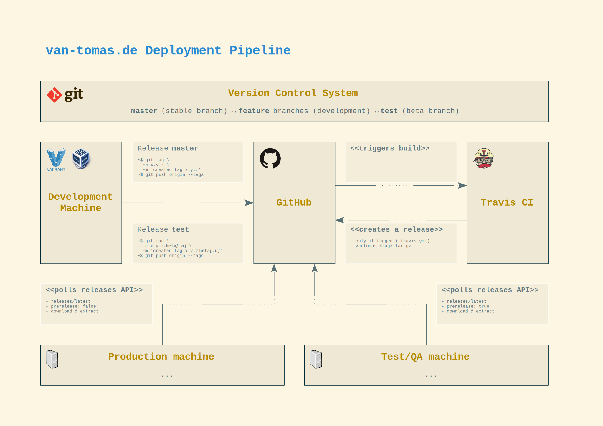

# Pull releases

## Table of contents

<!-- START doctoc generated TOC please keep comment here to allow auto update -->
<!-- DON'T EDIT THIS SECTION, INSTEAD RE-RUN doctoc TO UPDATE -->

- [Introduction](#introduction)
- [Requirements](#requirements)
- [Workflow](#workflow)
- [.travis.yml adjustments](#travisyml-adjustments)
- [Server-side installation](#server-side-installation)
- [Issues](#issues)
  - [OAuth token not working / Unauthorized error during deploy](#oauth-token-not-working--unauthorized-error-during-deploy)

<!-- END doctoc generated TOC please keep comment here to allow auto update -->

## Introduction

Since version 3.0.0 this project uses pull releases. This means: some automated routine will create a package, publishes
it somewhere and the staging systems will have their own, isolated release process.

A pull release is - in its simplest form - something like an `apt` command:

    ~$ apt-get update && apt-get upgrade

The necessary commands can be integrated into a crontab and the application will be continuously updated.

## Requirements

The GitHub repository needs to be linked with [Travis CI][travis].

## Workflow

This project follows some opinionated workflow:

  1.  Release package are build from tags
  2.  Tags must follow [Semantic Versioning][semver]
  3.  The **master** branch gets stable release tags (e.g `3.0.0`)
  4.  The **test** branch gets pre-relase denoted tags (e.g. `3.0.0-beta`)
  5.  Beta releases may have additional pre-release build numbers (e.g. `3.0.0-beta.1`)

The process can be visualized like the following:

## .travis.yml adjustments

If you want to use this setup with your own repository, you have to update the Travis CI deploy key:

    ~$ vagrant ssh
    ~$ cd /vagrant
    ~$ travis setup releases

**Note:** Please be careful and review the changes. The [Travis GitHub Releases documentation][travis_github_doc]
describes a sligthly different approach, which is also used in this project:

    # --snip--

    skip_cleanup: true
    on:
      tags: true

    # --snap--

## Server-side installation

**[TODO]** This topic will be handled in another project and documentation. For now, lets outline this with simple
pseudo code:

    > fetch latest releases from github
    > iterate releases
    >   check if release meets staging (production: stable tag, testing: -beta suffix)
    >   if false
    >     continue
    >   check if /path/to/project/root/.VERSION exists
    >   if true
    >     check if version is behind
    >     if false
    >       continue
    >   if false
    >     break
    > download and extract the package into the project root directory
    > adjust access rights, create folders
    > clear application cache
    > save current version into /path/project/root/.VERSION

Note, that this will remove composer *development dependencies*.

## Issues

### OAuth token not working / Unauthorized error during deploy

I could not get it working by first creating a GitHub OAuth token, encrypt it (`travis encrypt ...`) and add the
resulting value as an `api_key` setting. It seems, the OAuth token name must be in a specific format
(`automatic releases for REPO_OWNER/REPO_NAME`).

[travis]: https://travis-ci.org/
[semver]: http://semver.org/
[travis_github_doc]: https://docs.travis-ci.com/user/deployment/releases/
